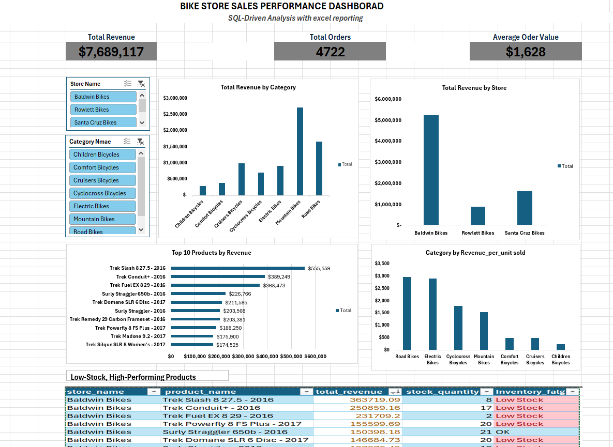

# excel-sql-sales-analysis
Sales performance analysis using Excel, SQL, and dashboards to generate business insights.
## 📊 Dashboard Preview

## 🔍 Key Business Insights

- Baldwin Bikes is the highest-revenue store, contributing the largest share of total sales.
- Mountain Bikes and Road Bikes are the top-performing product categories by revenue.
- Several high-revenue products are flagged as low stock, indicating potential inventory risk and missed sales opportunities.

## 🧠 SQL Analysis Overview

SQL was used to build a reusable sales view and generate key business metrics that support the Excel dashboard.

### Key SQL Techniques Used
- Created a **sales view (`vw_sales`)** to centralize revenue calculations
- Calculated core KPIs: Total Revenue, Total Orders, and Average Order Value (AOV)
- Analyzed revenue by **store, category, and product**
- Identified **top 10 products by revenue**
- Calculated **revenue per unit sold** to evaluate pricing performance
- Flagged **low-stock, high-performing products** to highlight inventory risk
- Prepared clean, analysis-ready data for **Excel pivot tables and dashboards**
